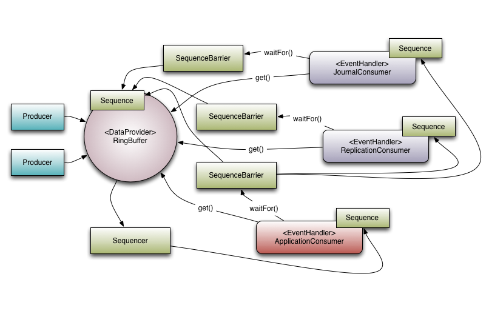

# Disruptor 快速入门

Disruptor 是一个高性能的并发编程框架，主要用于低延迟、高吞吐量的消息传递和事件处理。它由 LMAX 交易所开发，旨在替代传统的队列和锁机制，以实现更高效的并发处理。用 Disruptor 实现的交易系统每秒可以处理数百万次交易，延迟低至微秒级别。

## 关键概念
- **Ring Buffer**: Disruptor 的核心数据结构，是一个环形缓冲区，用于存储事件。它允许多个生产者和消费者高效地读写数据。
- **Event**: 事件是 Disruptor 中传递的数据单元，通常是一个简单的对象 （POJO）。
- **Producer**: 生产者负责将事件发布到 Ring Buffer 中。
- **Event Handler**: 事件处理器是消费者的实现，用于处理从 Ring Buffer 中读取的事件。
- **Wait Strategy**: 等待策略定义了消费者在等待事件时的行为，可以选择不同的策略以优化性能。
- **Sequencer**: 序列器用于管理 Ring Buffer 中事件的顺序，确保生产者和消费者之间的协调。
- **Barrier**: 屏障用于协调多个消费者，确保它们按正确的顺序处理事件。

### Ring Buffer
Ring Buffer 是 Disruptor 的核心组件，它是一个固定大小的数组，形成一个环形结构。生产者将事件写入 Ring Buffer，而消费者从中读取事件。Ring Buffer 的大小**必须**是 2 的幂，以便于计算索引。

## Getting Started

## 参考资料
- [Disruptor 官方文档](https://lmax-exchange.github.io/disruptor/)
- [美团技术博客 - 高性能队列——Disruptor](https://tech.meituan.com/2016/11/18/disruptor.html)
